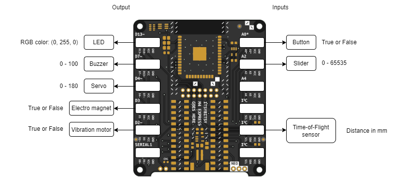

# 2022-Interaction-Studies

A creature in the Great Interactive Reef has one input and two outputs (one of which is an RGB LED).

This directory holds the code to drive the input and output as well as the communication with the spirit and the other creatures. First thing to do when you run the code is give your creature a unique ID, from then on the creature will respond to day/night changes and show default presence detection on the basis of a button. In addition the communication about the creatures enegery level is taken care of.

